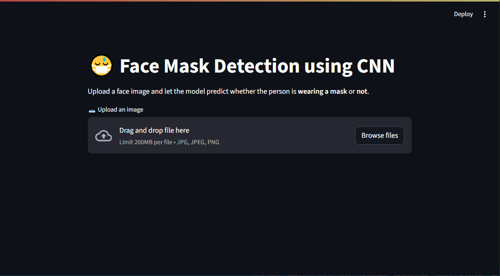

# 😷 Face Mask Detection using CNN

> A Deep Learning project that detects whether a person is wearing a face mask or not using a Convolutional Neural Network (CNN). Built for internship submission, deployed with Streamlit.

---

## 📌 Project Overview

This project is part of a college internship where we train a CNN model to classify images as either:

- **with_mask**
- **without_mask**

The dataset is obtained via the Kaggle API and the model is built and trained in Google Colab using TensorFlow. The final model is deployed using a Streamlit web app where users can upload images and receive predictions in real-time.

---

## 🖼️ UI Preview

<div align="center">
  
  <p><em>🔍 Sample output from the Face Mask Detection Streamlit Web App</em></p>
</div>


## 🧠 Technologies Used

- Python
- TensorFlow / Keras
- Google Colab
- Kaggle API
- Splitfolders
- Streamlit
- Seaborn & Matplotlib

---

✅ Features
CNN-based real-time image classification

Trained with Kaggle API dataset in Colab

Automatic dataset split (Train/Val/Test)

Confusion matrix and F1-report included

Streamlit web interface for live predictions

---

## 📁 Folder Structure

face-mask-detection/
│
├── app.py # Streamlit app
├── README.md # Project documentation
├── requirements.txt # Python dependencies
└── face-mask-detection.ipynb # Google Colab notebook
├── assets/
    ├── streamlit-ui.png  ← ✅ This is the image of ui
    └──ui-on-sample-data.png  ← ✅ This is the image of model working on sample
---

## 🚀 Getting Started

### ✅ 1. Clone this repo

```bash
git clone https://github.com/yourusername/face-mask-detection.git
cd face-mask-detection
✅ 2. Install Dependencies
Make sure you have Python ≥ 3.8 and install all requirements:

bash

pip install -r requirements.txt
If TensorFlow fails to install, install Microsoft C++ Redistributable and check Python version compatibility.

📦 Model Training (Colab)
Open the Face_Mask_Detection.ipynb notebook in Google Colab and:

Automatically download dataset using Kaggle API

Preprocess & augment images

Build and train CNN

Plot accuracy/loss graphs

Save model as .h5 file

🖥️ Run the Web App Locally
bash

streamlit run app.py
Once running, visit:  http://localhost:8501
You can upload an image and get instant predictions for:

😷 With Mask

😡 Without Mask

🧠 Model Architecture
3 Convolutional + MaxPooling layers

Flatten → Dense (128 units)

Dropout(0.5)

Output: 2 neurons with softmax

Trained with:

categorical_crossentropy loss

Adam optimizer

10 epochs

📊 Confusion Matrix & Evaluation
Evaluate on test data using:

Accuracy

Loss

Confusion Matrix

Classification Report

📌 Dataset
Face Mask Dataset by Omkar Gurav

Classes:

with_mask 😷

without_mask 😡

---

## 📸 Sample Prediction Output

<div align="center">
  
  <p><em>🧠 Model prediction: with_mask / without_mask, with confidence level</em></p>
</div>


## 📊 Dataset

The model is trained on the publicly available **Face Mask Dataset** from Kaggle, which contains images of people **with and without face masks**.

👉 [Click here to view/download the dataset on Kaggle](https://www.kaggle.com/datasets/omkargurav/face-mask-dataset)

- Contains 2 categories: `with_mask` and `without_mask`
- Images are split into Train (80%), Validation (10%), and Test (10%) using `splitfolders`
> Note: You'll need a Kaggle account to access the dataset.

---

🌐 Deployment Options
✅ Localhost via Streamlit

✅ Public share with ngrok

✅ Free HTTPS hosting via Streamlit Cloud
---

## 🚀 How to Run the Streamlit App Locally

1. Clone this repository:

```bash
git clone https://github.com/rajwant-raj/face-mask-detection.git
cd face-mask-detection
Install required packages:

bash

pip install -r requirements.txt
Run the app:

bash

streamlit run app.py


🧪 Sample Output
Test Accuracy: ~97–99%

Includes accuracy/loss plots, confusion matrix, and classification report

Real-time prediction on uploaded images using mask_detector_model.h5


📚 Internship Use
This project was developed by me as part of a my summer internship of scalezix to demonstrate:

Applied deep learning skills 

Model evaluation with metrics

Deployment-ready web interface using Streamlit

🤝 Acknowledgements
Omkar Gurav - Dataset Creator

Kaggle

Streamlit

🧑‍💻 Developed By
Rajwant-Raj
Intern @ [Scalezix]

